# 서울 12기 4반 A404 동철팀 Gitlab

## 회원가입 및 로그인

- 회원가입
    - 스크린샷
        
        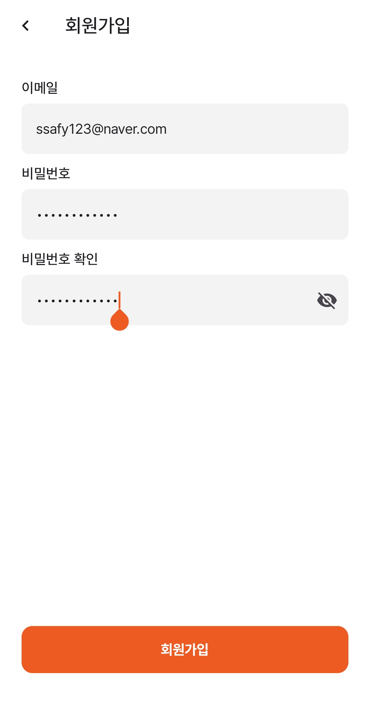
        
    
    - 소개 : 회원가입(회원 계정 생성)을 위한 화면
    
    - 상세 기능
    
      1. 이메일 입력 필드
          1. 사용자는 회원가입에 사용할 이메일을 입력합니다.
          2. 이메일 형식이 올바르지 않으면 오류 메시지가 표시 될 수 있습니다.
      2. 비밀번호 입력 필드
          1. 사용자가 원하는 비밀번호를 입력합니다.
          2. 보안 강화를 위해 비밀번호는 가려져 있으며, 오른쪽 아이콘을 눌러 가시성을 변경할 수 있습니다.
      3. 비밀번호 확인 필드
          1. 사용자가 입력한 비밀번호를 다시 입력하여 확인합니다.
          2. 입력한 비밀번호와 일치하지 않으면 오류 메시지가 나타날 수 있습니다.
      4. 비밀번호 가시성 토글 버튼 (눈 모양 아이콘)
          1. 사용자가 이 버튼을 누르면 비밀번호가 보이거나 숨겨집니다.
      5. 회원가입 버튼 (하단 주황색 버튼)
          1. 모든 입력이 올바르게 작성되었을 경우 활성화됩니다.
          2. 버튼을 누르면 입력한 정보를 서버로 전송하여 계정을 생성합니다.
          3. 필수 입력값이 누락되었거나 오류가 있을 경우 경고 메시지가 표시됩니다.
    

- 사장 / 유저 선택
    - 스크린샷
        
        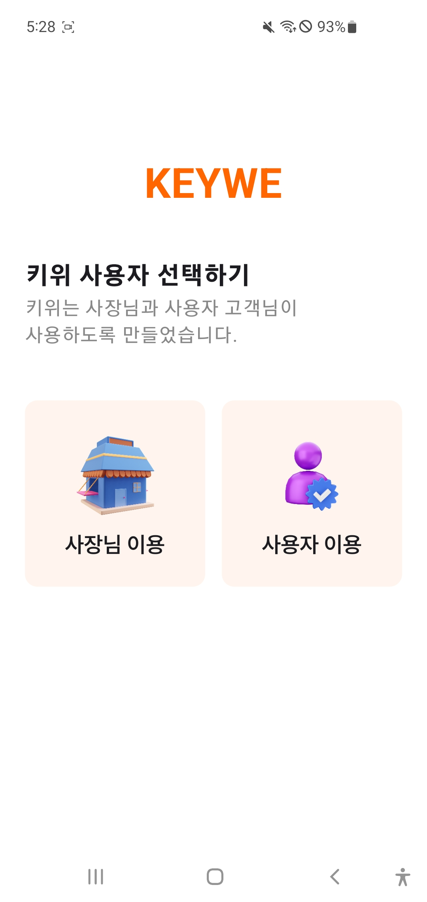
        
    
    - 소개 :  **"KEYWE"** 애플리케이션의 사용자 유형을 선택하는 페이지. 사용자는 **사장님(관리자) 또는 일반 사용자(고객)** 중 하나를 선택하여 앱을 이용할 수 있습니다.
    - 상세 기능
    
      1. 타이틀 및 설명
          1. 상단에 "KEYWE" 로고가 표시됩니다.
          2. 그 아래에는 “키위는 사장님과 사용자 고객님이 사용하도록 만들어졌습니다.”라는 설명이 제공되어, 앱이 두 가지 사용자 유형을 지원함을 안내합니다.
      2. 사용자 유형 선택 버튼
          1. 사장님 이용 (왼쪽 버튼)
              1. 가게를 운영하는 사장님을 위한 서비스에 접근할 수 있습니다.
              2. 선택 시, 사장님전용 기능(매장 관리, 키오스크 설정 등)이 제공되는 페이지로 이동합니다.
          2. 사용자 이용(오른쪽 버튼)
              1.  고객(일반 사용자)를 위한 서비스로 이동합니다.
              2. 선택 시, 사용자는 키오스크를 이용하는 기능 및 기타 서비스를 사용할 수 있습니다.
      3. UI 디자인 특징
          1. 두 개의 버튼이 나란히 배치되어 있어 한눈에 이해하기 쉽습니다.
          2. 버튼에는 각각 아이콘(가게, 사용자 프로필)이 포함되어 있어 시각적으로 직관적입니다.
          3. 부드러운 색상과 깔끔한 배치로 사용성이 높습니다.
    

- 사장님 로그인
    - 스크린샷
        
        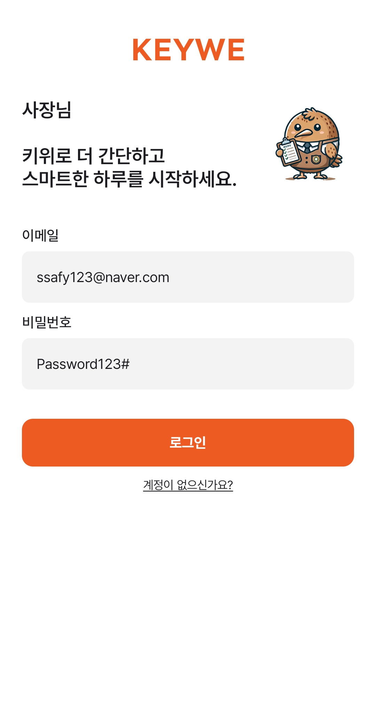
        
    - 소개 : **사장님(관리자) 전용 로그인 페이지.** 매장을 운영하는 사용자가 로그인하여 서비스를 이용할 수 있도록 구성되어 있습니다.
    
    - 상세기능
    
      1. 앱 로고(KEYWE) 및 안내 문구
          1. 화면 상단에 **"KEYWE"** 로고가 표시됩니다.
          2. 그 아래에는 "사장님, 키위로 더 간단하고 스마트한 하루를 시작하세요."라는 문구가 있어, 서비스의 목적을 설명합니다.
          3. 우측에는 귀여운 마스코트 이미지가 있어 친근한 느낌을 줍니다.
      2. 이메일 입력 필드
          1. 사용자가 로그인할 이메일을 입력하는 곳입니다.
          2. 이메일 형식이 올바르지 않으면 오류 메시지가 표시될 수 있습니다.
          3. 입력을 하고 난 후 해당 이메일로 인증 확인 메일이 도착합니다.
          4. 메일 수신을 하고 “인증하기”버튼을 누르면 이메일 인증이 완료되어집니다.
      3. 비밀번호 입력 필드
          1. 사용자가 비밀번호를 입력하는 곳입니다.
          2. 보안 강화를 위해 비밀번호는 기본적으로 숨겨진 상태입니다.
      4. 로그인 버튼 (주황색 버튼)
          1. 입력된 이메일과 비밀번호가 올바를 경우, 버튼을 클릭하면 로그인됩니다.
          2. 계정 정보가 일치하지 않으면 오류 메시지가 나타날 수 있습니다.
      5. 회원가입 유도 문구
          1. “계정이 없으신가요?” 문구가 하단에 위치하여 회원강비을 하지 않은 사용자를 위해 가입 페이지로 이동할 수 있도록 유도합니다.
          2. 클릭 시, 회원가입 페이지로 이동할 가능성이 높습니다.

- 이용자 로그인
    - 스크린샷
        
        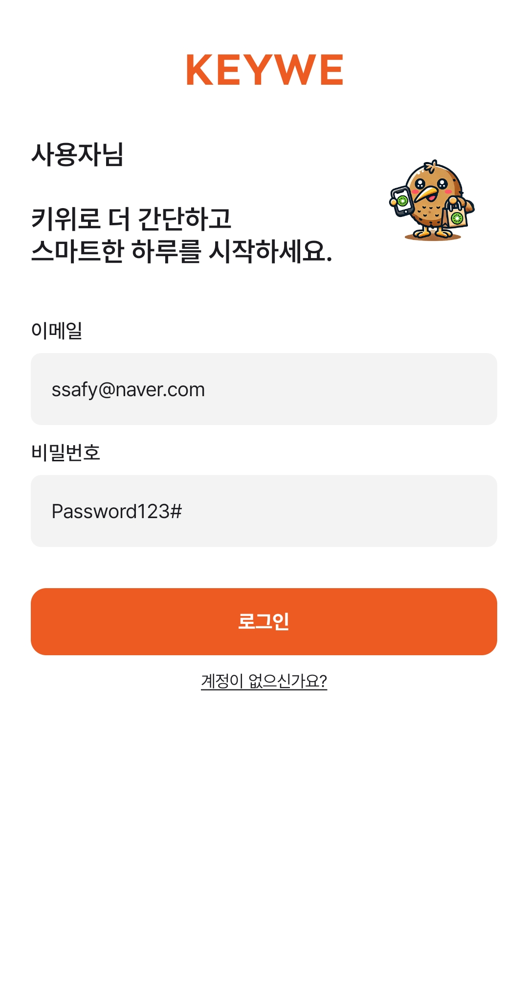
        
    
    - 소개 : **일반 사용자(고객) 로그인 페이지.** 키오스크를 이용하는 고객이 로그인하여 서비스를 사용할 수 있도록 구성되어 있습니다.
    
    - 상세기능 
    
      1. 앱 로고(KEYWE) 및 안내 문구
          1. 화면 상단에 **"KEYWE"** 로고가 표시됩니다.
          2. 그 아래에는 "사용자, 키위로 더 간단하고 스마트한 하루를 시작하세요."라는 문구가 있어, 서비스의 목적을 설명합니다.
          3. 우측에는 **마스코트 이미지**가 있으며, 사용자가 키오스크 및 모바일 기기를 이용하는 모습을 표현하여 서비스의 목적을 직관적으로 보여줍니다.
      2. 이메일 입력 필드
          1. 사용자가 로그인할 이메일을 입력하는 곳입니다.
          2. 이메일 형식이 올바르지 않으면 오류 메시지가 표시될 수 있습니다.
          3. 입력을 하고 난 후 해당 이메일로 인증 확인 메일이 도착합니다.
          4. 메일 수신을 하고 “인증하기”버튼을 누르면 이메일 인증이 완료되어집니다.
      3. 비밀번호 입력 필드
          1. 사용자가 비밀번호를 입력하는 곳입니다.
          2. 보안 강화를 위해 비밀번호는 기본적으로 숨겨진 상태입니다.
      4. 로그인 버튼 (주황색 버튼)
          1. 입력된 이메일과 비밀번호가 올바를 경우, 버튼을 클릭하면 로그인됩니다.
          2. 계정 정보가 일치하지 않으면 오류 메시지가 나타날 수 있습니다.
      5. 회원가입 유도 문구
          1. “계정이 없으신가요?” 문구가 하단에 위치하여 회원강비을 하지 않은 사용자를 위해 가입 페이지로 이동할 수 있도록 유도합니다.
          2. 클릭 시, 회원가입 페이지로 이동할 가능성이 높습니다.

## 프로필
- 프로필 추가(부모)
    - 스크린샷
        
        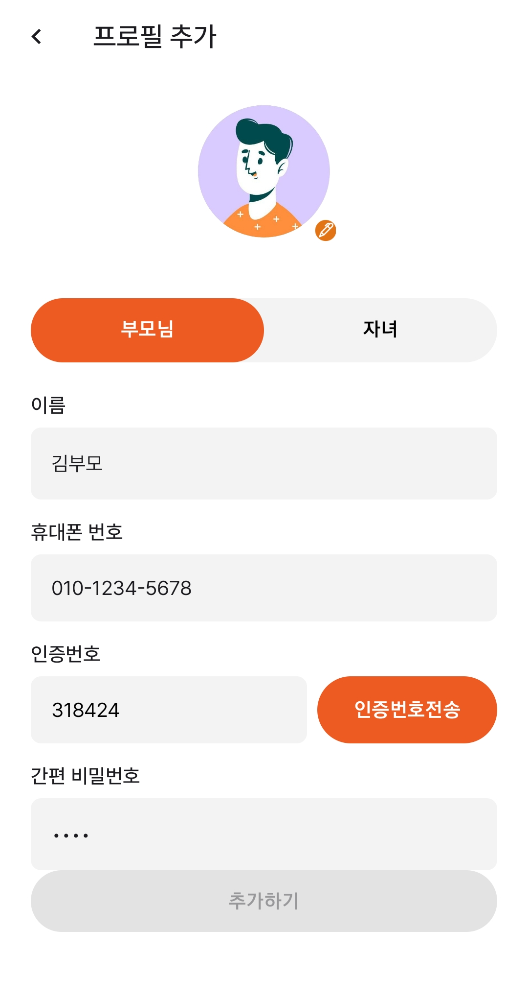
        
    
    - 소개 : **사용자의 프로필을 추가하는 페이지.** 부모님의 정보를 입력하여 계정을 생성할 수 있도록 구성되어 있습니다.
    - 상세기능
    
      1. 프로필 이미지 및 수정 버튼
          1. 화면 상단에  사용자 프로필 이미지가 표시됩니다.
          2. 오른쪽 하단의 **연필 아이콘**을 눌러 프로필 사진을 변경할 수 있습니다.
      2. 사용자 유형 선택 (부모님 / 자녀)
          1. **부모님** 또는 **자녀** 중 하나를 선택할 수 있는 버튼이 제공됩니다.
          2. 현재 "부모님"이 선택된 상태이며, 선택된 버튼은 **주황색**으로 강조됩니다.
          3. **자녀**를 선택하면 입력 필드가 자녀에 맞게 변경될 수 있습니다.
      3. 이름 입력 필드
          1. 사용자의 이름을 입력하는 필드입니다.
          2. 현재 "김부모"가 입력된 상태입니다.
      4. 휴대폰 번호 입력 필드
          1. 사용자의 휴대폰 번호를 입력하는 필드입니다.
          2. 현재 "010-1234-5678"이 입력된 상태입니다.
      5. 인증번호 입력 및 전송 버튼
          1. 사용자가 **인증번호**를 입력하는 필드가 제공됩니다.
          2. 인증번호를 받기 위해 오른쪽 **"인증번호 전송" 버튼**을 클릭해야 합니다.
          3. 버튼을 클릭하고 나면 해당 번호로 인증번호 문자가 발송됩니다.
          4. 인증번호 6자리를 입력하고 인증 확인 버튼을 누르면 인증 성공 여부의 문구가 나타납니다.
          5. 인증번호가 입력되지 않았거나 틀린 경우, 추가적인 안내 메시지가 표시될 수 있습니다.
      6. 간편 비밀번호 입력 필드
          1. 사용자가 로그인 시 간편하게 사용할 비밀번호를 설정하는 필드입니다.
          2. 가려놓은 상태이지만, 간편 비밀번호 4자리가 모두 입력된 상태입니다.
      7. 추가하기 버튼 (비활성화 상태)
          1. 프로필을 추가하는 버튼입니다.
          2. 현재 **비활성화(회색)** 상태이며, 인증이 성공되고 필수 정보가 모두 입력되면 주황색 버튼으로 활성화될 것입니다.
        
- 프로필 추가(자녀)
    - 스크린샷
        
        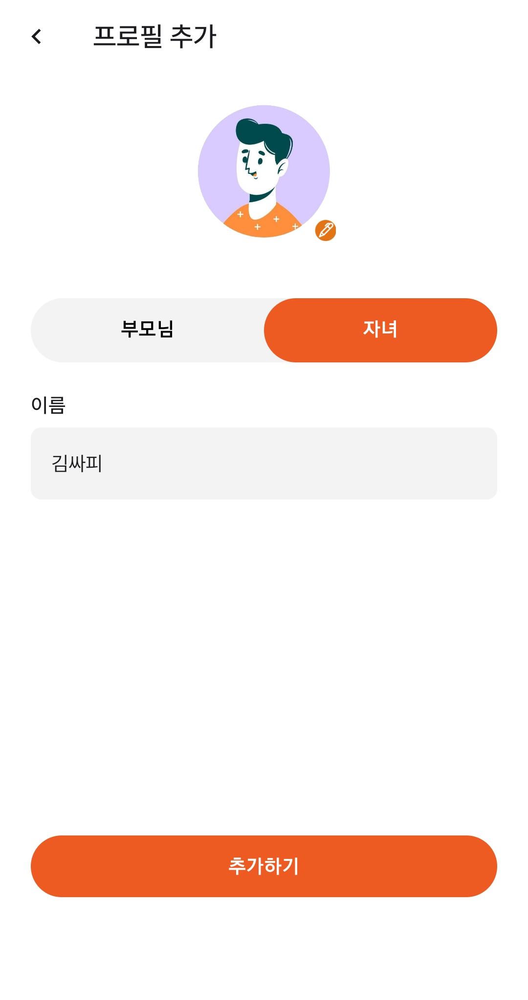
        
    
    - 소개 : **사용자의 프로필을 추가하는 페이지.** 자녀의 정보를 입력하여 계정을 생성할 수 있도록 구성되어 있습니다.
    - 상세기능
    
      1. 프로필 이미지 및 수정 버튼
          1. 화면 상단에  사용자 프로필 이미지가 표시됩니다.
          2. 오른쪽 하단의 **연필 아이콘**을 눌러 프로필 사진을 변경할 수 있습니다.
      2. 사용자 유형 선택 (부모님 / 자녀)
          1. **부모님** 또는 **자녀** 중 하나를 선택할 수 있는 버튼이 제공됩니다.
          2. 현재 "자녀"가 선택된 상태이며, 선택된 버튼은 **주황색**으로 강조됩니다.
          3. **자녀**를 선택하면 입력 필드가 자녀에 맞게 변경될 수 있습니다.
      3. 이름 입력 필드
          1. 사용자의 이름을 입력하는 필드입니다.
          2. 현재 "김싸피"가 입력된 상태입니다.
      4. 추가하기 버튼 (비활성화 상태)
          1. 프로필을 추가하는 버튼입니다.
          2. 현재 **비활성화(회색)** 상태이며, 인증이 성공되고 필수 정보가 모두 입력되면 주황색 버튼으로 활성화될 것입니다.

- 프로필 수정(부모)
    - 스크린샷
        
        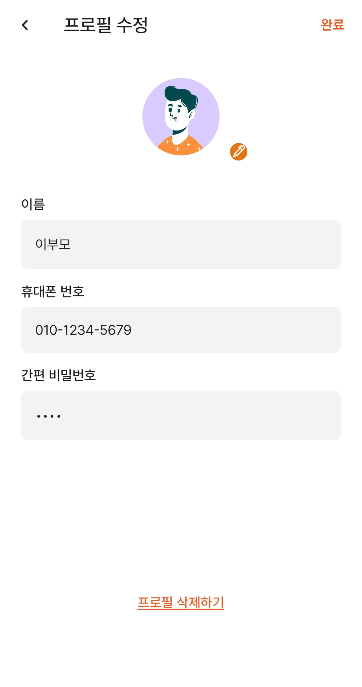
        
    
    - 소개 :  **사용자가 기존 프로필을 수정할 수 있는 페이지**. 사용자는 이름, 휴대폰 번호, 간편 비밀번호를 확인하거나 변경할 수 있으며, 프로필을 삭제할 수도 있습니다.
    
    - 상세기능
    
      1. 프로필 이미지 및 수정 버튼
          1. 화면 상단에 프로필 이미지가 표시됩니다.
          2. 오른쪽 하단의 **연필 아이콘**을 눌러 프로필 사진을 변경할 수 있습니다.
      2. 이름 입력 필드 (비활성화 상태)
          1. 사용자 이름이 표시되지만, 현재는 수정이 불가능한 상태로 보입니다.
          2. "이부모"라는 이름이 등록되어 있습니다.
      3. 휴대폰 번호 입력 필드 (비활성화 상태)
          1. 사용자의 휴대폰 번호가 표시됩니다.
          2. 현재 **"010-1234-5679"**로 등록되어 있으며, 수정이 불가능한 상태로 보입니다.
      4. 간편 비밀번호 입력 필드
          1. 사용자가 로그인 시 사용할 **간편 비밀번호**를 설정할 수 있는 필드입니다.
          2. 현재 입력된 상태(****)로 보이며, 변경이 가능한지 여부는 불분명합니다.
      5. 완료 버튼 (오른쪽 상단)
          1. 수정이 필요한 부분을 변경한 후, **완료** 버튼을 클릭하여 변경 사항을 저장할 수 있습니다.
      6. 프로필 삭제하기 버튼 (하단)
          1. 사용자가 현재 프로필을 삭제하고 싶을 경우, "프로필 삭제하기"를 클릭하면 됩니다.
          2. 클릭 시, “삭제하시겠습니까?” 라는 삭제 확인 팝업이 나타납니다. 확인 버튼을 누르면 프로필이 삭제되고 로그인 홈으로 다시 돌아옵니다.

- 프로필 수정(자녀)
    - 스크린샷
        
        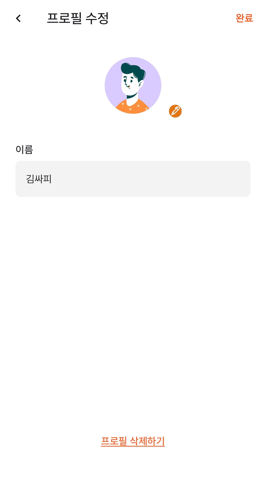
        
    
    - 소개 : **사용자가 자신의 프로필을 수정하거나 삭제할 수 있는 페이지**. 프로필의 이름을 확인할 수 있으며, 필요에 따라 프로필을 삭제할 수도 있습니다.
    
    - 상세 기능
    
      1. 프로필 이미지 및 수정 버튼
          1. 화면 상단에는 현재 프로필 사진이 표시됩니다.
          2. **연필 아이콘**을 눌러 프로필 사진을 변경할 수 있습니다.
      2. 이름 입력 필드 (비활성화 상태)
          1. 현재 등록된 이름(예: **김싸피**)이 표시됩니다.
          2. 입력 필드가 **비활성화(회색 처리)** 되어 있어 수정이 불가능한 상태로 보입니다.
      3. 완료 버튼 (오른쪽 상단)
          1. 수정 가능한 항목이 있다면 변경 후 **"완료" 버튼을 클릭하여 저장**할 수 있습니다.
          2. 현재는 이름만 표시되고 있어, 다른 정보를 수정할 수 있는지 여부는 불분명합니다.
      4. 프로필 삭제하기 버튼 (하단)
          1. 현재 프로필을 삭제하려면 **"프로필 삭제하기"** 버튼을 클릭하면 됩니다.
          2. 버튼이 **주황색 텍스트**로 표시되어 있으며, 클릭 시 확인 팝업이 나타날 가능성이 높습니다.
        
- 프로필 선택
    - 스크린샷
        
        
        
    
    - 소개 : **사용자가 로그인 후 사용할 프로필을 선택하는 페이지**. 여러 개의 프로필 중 하나를 선택하여 해당 계정으로 서비스를 이용할 수 있습니다.
    
    - 상세기능
    
      1. 타이틀 - "프로필 선택”
          1. 화면 상단에 "프로필 선택"이라는 제목이 있어, 사용자가 어떤 작업을 수행해야 하는지 명확히 알 수 있습니다.
      2. 부모님 프로필 목록
          1. "부모님" 섹션 아래에 등록된 부모님 계정들이 표시됩니다.
          2. 현재 "김부모"와 **"이부모"** 두 개의 계정이 등록되어 있으며, 각각 다른 프로필 이미지가 설정되어 있습니다.
          3. 사용자는 해당 프로필을 선택하여 로그인할 수 있습니다.
      3. 자녀 프로필 목록
          1. "자녀" 섹션 아래에 자녀의 프로필이 표시됩니다.
          2. 현재 “김싸피”라는 자녀 계정이 등록되어 있으며, 사용자 아바타가 설정되어 있습니다.
          3. 자녀 계정 또한 선택하여 로그인 할 수 있습니다.
      4. 계정 추가 버튼
          1. 화면 하단에는 “+ 계정 추가” 버튼이 있습니다.
          2. 새로운 프로필을 추가하려면 이 버튼을 눌러 새로운 계정을 등록할 수 있습니다.
          3. 부모님과 자녀 계정 모두 추가가 가능할 가능성이 높습니다.
        
- 프로필 상세 페이지(자녀 / 부모)
    - 스크린샷
        
        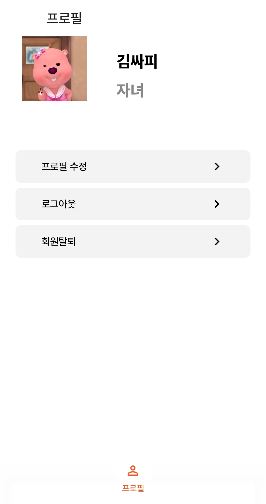
        
    
    - 소개 : **사용자가 자신의 프로필을 관리할 수 있는 페이지.** 프로필 수정, 로그아웃, 회원 탈퇴 등의 기능을 제공합니다.
    
    - 상세기능
    
      1. **프로필 정보**
          - 화면 상단에는 사용자의 프로필 사진이 표시됩니다.
          - 프로필 이름(예: **김싸피**)과 사용자 유형(예: **자녀**)이 명확하게 나타나 있습니다.
          - 부모의 경우 “부모”의 역할과 핸드폰 번호가 같이 보일 예정입니다.
      2. **프로필 수정 버튼**
          - **"프로필 수정"** 버튼을 클릭하면 사용자가 프로필 정보를 변경할 수 있는 페이지로 이동합니다.
          - 프로필 사진, 이름, 비밀번호 등을 수정할 수 있을 가능성이 높습니다.
      3. **로그아웃 버튼**
          - **"로그아웃"** 버튼을 누르면 현재 계정에서 로그아웃됩니다.
          - 클릭 후 로그인 화면으로 이동하거나, 프로필 선택 화면으로 돌아갈 수 있습니다.
      4. **회원 탈퇴 버튼**
          - **"회원 탈퇴"** 버튼을 누르면 현재 계정을 영구적으로 삭제할 수 있습니다.
          - 클릭 시, 삭제 확인 팝업이 나타날 가능성이 높으며, 계정이 삭제되면 다시 복구할 수 없을 수도 있습니다.
      5. **하단 네비게이션 바 - 프로필 아이콘 활성화**
          - 하단 네비게이션 바에서 **"프로필"** 아이콘이 강조되어 있으며, 현재 사용자가 프로필 관리 화면에 있다는 것을 나타냅니다.

# 주문 선택
- 주문 선택
  - 스크린샷
  - 소개 : **사용자가 주문 방식을 선택하는 키오스크의 초기 화면** 사용자는 **일반 주문** 또는 **대리 주문** 중 하나를 선택할 수 있습니다.
  - 상세 기능
    1. **타이틀 - "KEYWE" 및 안내 문구**
       - 상단에는 브랜드명 **"KEYWE"**가 강조되어 있습니다.
       - "**어떤 주문을 하시겠습니까?**"라는 질문을 통해 사용자가 주문 방식을 선택하도록 유도합니다.
       - 추가 안내문: "**대리 주문 이용 중 연결이 끊길 시 주문 내용이 초기화됩니다.**"
       - 대리 주문 기능이 네트워크 연결을 필요로 하며, 연결이 끊길 경우 주문이 사라질 수 있음을 사용자에게 알립니다.
    2. **주문 방식 선택 버튼**
       - **"일반 주문" (왼쪽 버튼)**
        - 사용자가 직접 키오스크에서 메뉴를 선택하고 결제하는 방식입니다.
        - 일반적인 무인 키오스크 이용과 동일합니다.
       - **"대리 주문" (오른쪽 버튼)**
        - 원격으로 주문을 대신 진행할 수 있는 기능입니다.
        - 스마트폰이나 다른 기기를 통해 주문이 이루어질 가능성이 높습니다.
        - **네트워크 연결이 필요한 기능**이므로 연결이 끊기면 주문이 초기화될 수 있음이 강조됩니다.
    3. **키오스크 사장님 로그아웃 버튼 (하단)**
       - 하단에는 "**키오스크 사장님 로그아웃**"이라는 작은 텍스트 버튼이 있습니다.
       - 키오스크 운영자가 로그아웃하고 관리자 모드에서 나갈 수 있도록 합니다.

# 일반 주문
- 메뉴 조회
  - 스크린샷
      - 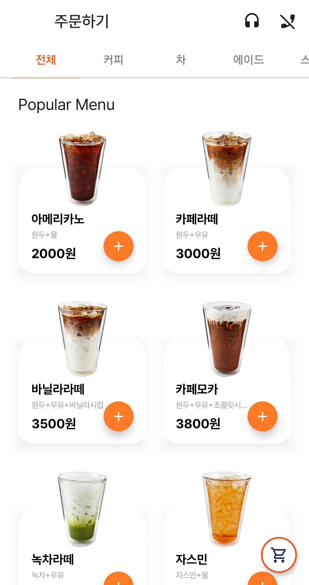

  - 소개 : **주문 키오스크에서 장바구니에 담긴 음료의 옵션을 수정하는 페이지**. 사용자는 선택한 음료의 크기, 온도, 추가 옵션을 조정할 수 있으며, 최종 가격을 확인한 후 수정할 수 있습니다.

  - 상세기능  

      1. **음료 정보 표시**
          - 사용자가 장바구니에 담은 **"바닐라라떼"**의 세부 정보가 표시됩니다.
          - 현재 선택된 크기: **Grande**
          - 현재 선택된 온도: **Ice**
          - 추가된 옵션:
              - 시럽 추가 2개
              - 샷 추가 1개
              - 휘핑 크림 추가 1개
      2. **옵션 변경 (크기 & 온도 선택)**
          - 사용자는 **Tall, Grande, Venti** 중에서 크기를 선택할 수 있습니다.
          - **Hot 또는 Ice**를 선택하여 음료 온도를 변경할 수 있습니다.
          - 현재 선택된 옵션(Grande, Ice)이 주황색 테두리로 강조되어 있습니다.
      3. **추가 옵션 조절 (수량 변경)**
          - 사용자는 추가 옵션을 조정할 수 있습니다.
          - **"+" 버튼**을 눌러 옵션 개수를 추가하고, **"-" 버튼**을 눌러 개수를 줄일 수 있습니다.
          - 현재 선택된 옵션 개수:
              - 휘핑 크림 추가: **1개** (+700원)
              - 샷 추가: **1개** (+500원)
              - 시럽 추가: **2개** (+300원 × 2)
      4. **최종 가격 표시**
          - 현재 옵션을 반영한 총 가격이 **6300원**으로 표시됩니다.
          - 옵션을 변경하면 가격이 자동으로 업데이트될 가능성이 높습니다.
      5. **하단 버튼 (취소 & 수정)**
          - **"취소" 버튼**: 옵션 변경 없이 장바구니 화면으로 돌아갑니다.
          - **"수정" 버튼**: 선택한 옵션을 반영하여 장바구니를 업데이트합니다.

- 메뉴 상세 조회
  - 스크린샷
    - 
  - 소개 : **키오스크에서 사용자가 원하는 음료를 선택하고 옵션을 조정하여 주문할 수 있는 페이지**. 사용자는 음료의 크기, 온도, 추가 옵션을 설정한 후, 최종 결정을 내릴 수 있습니다.
  - 기능 설명
    1. **음료 정보 표시**
      - 선택한 음료: **바닐라라떼**
      - 설명: **"달콤한 바닐라 향과 부드러운 우유가 어우러진 매력적인 라떼."**
      - 기본 가격: **5200원**
      - 음료 이미지가 상단에 표시되어 사용자가 선택한 제품을 직관적으로 확인할 수 있습니다.
    2. **옵션 선택 (크기 & 온도 변경)**
      - 사용자는 **Tall, Grande, Venti** 중 크기를 선택할 수 있습니다.
      - 현재 선택된 크기: **Grande** (주황색 테두리로 강조)
      - **Hot 또는 Ice** 중 음료 온도를 선택할 수 있습니다.
      - 현재 선택된 온도: **Ice** (주황색 테두리로 강조)
    3. **추가 옵션 선택**
      - 사용자는 기본 음료 외에도 추가 옵션을 선택할 수 있습니다.
      - **휘핑 크림 추가: 700원** (현재 1개 추가됨)
      - **샷 추가: 500원** (현재 1개 추가됨)
      - 옵션은 **"+" 버튼을 눌러 추가**하거나, **"-" 버튼을 눌러 제거**할 수 있습니다.
    4. **하단 버튼 (담기 & 주문하기)**
      - **"담기" 버튼**: 현재 선택한 옵션을 장바구니에 추가하고, 다른 음료를 더 선택할 수 있도록 합니다.
      - **"주문하기" 버튼**: 바로 결제 단계로 진행하여 주문을 확정합니다.
- 장바구니
  - 스크린샷
    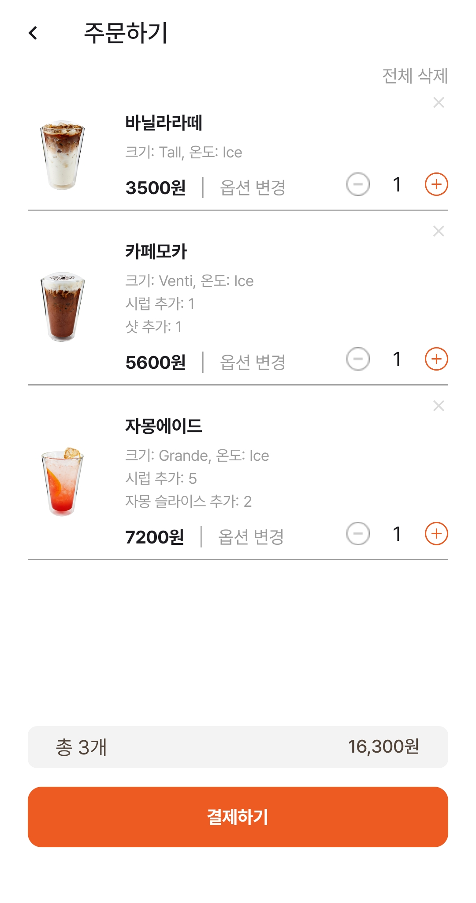
  - 소개 : **키오스크에서 사용자가 주문한 항목을 확인하고, 수량 및 옵션을 조정한 후 결제하는 페이지.**
  - 기능 설명
    1. **주문 목록**
       - 사용자가 장바구니에 담은 **음료 목록이 나열**됩니다.
       - 각 음료의 **이름, 크기, 온도, 추가 옵션, 가격, 수량**이 표시됩니다.
    2. **각 음료 항목의 기능**
       - **"-" 버튼**: 해당 음료의 수량을 줄일 수 있습니다.
       - **"+" 버튼**: 해당 음료의 수량을 추가할 수 있습니다.
       - **"옵션 변경" 버튼**: 클릭하면 음료 옵션(크기, 온도, 추가 재료)을 수정할 수 있는 화면으로 이동합니다.
       - **삭제 버튼 (X)**: 특정 음료를 장바구니에서 제거할 수 있습니다.
    3. **총 주문 개수 및 금액 표시**
       - **총 주문 개수: 3개**
       - **총 주문 금액: 16,300원**
       - 주문 금액은 선택한 옵션 및 수량 변경에 따라 실시간으로 업데이트될 가능성이 높습니다.
    4. **하단 버튼 - "결제하기"**
       - 사용자가 **주문을 확정하고 결제 단계로 이동**하려면 **"결제하기" 버튼**을 클릭합니다.

- 메뉴 카테고리 조회
  - 스크린샷
    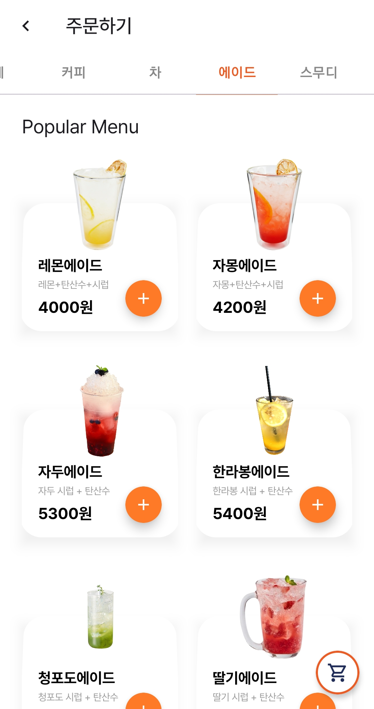

  - 소개 : 키오스크에서 사용자가 원하는 음료를 선택하여 장바구니에 추가할 수 있는 메뉴 선택 페이지.

  -  **기능 설명**

     1. **카테고리 탭 (상단 메뉴 바)**
         - 사용자는 다양한 음료 카테고리 중 하나를 선택할 수 있습니다.
         - 현재 선택된 카테고리는 **"에이드"**, 주황색 글씨로 강조되어 있습니다.
         - 다른 카테고리(커피, 차, 스무디)를 선택하면 해당 음료 목록이 나타날 가능성이 높습니다.
     2. **Popular Menu (인기 메뉴 리스트)**
         - 인기 있는 메뉴들이 **카드 형식**으로 나열되어 있습니다.
         - 각 메뉴에는 **음료 이미지, 이름, 주요 성분, 가격, 추가 버튼(+)**이 포함되어 있습니다.
     3. **음료 선택 및 추가 버튼(+)**
         - 각 음료 항목에는 **"+" 버튼**이 있어, 사용자가 원하는 음료를 장바구니에 추가할 수 있습니다.
         - 예를 들어, "**자몽에이드(4200원)**"을 추가하려면 해당 음료의 "+" 버튼을 누르면 됩니다.
         - 여러 개를 선택하면 장바구니에 추가될 가능성이 높습니다.
     4. **장바구니 버튼 (하단 우측)**
         - 화면 오른쪽 하단에 **장바구니 아이콘**이 떠 있습니다.
         - 사용자가 장바구니에 담은 제품을 확인하고 결제할 수 있도록 이동하는 버튼입니다.

# 대리 주문

소개 : **자녀가 원격으로 대리 주문을 진행할 때 키오스크에서 표시되는 화면**. 부모님이 직접 조작할 수 있는 부분과 자녀가 원격으로 조작하는 부분이 나누어져 있습니다.

### **기능 설명**

1. **상단 알림 - "KeyWe 서비스를 이용 중입니다."**
    - 현재 키오스크가 **대리 주문 모드**로 동작 중임을 나타냅니다.
    - 원격 주문이 활성화된 상태이므로, **자녀가 스마트폰을 통해 키오스크 화면을 조종**할 수 있습니다.
2. **주황색 테두리 - 원격 조종 영역**
    - 화면의 주황색 테두리 안쪽은 **자녀가 원격으로 조작 중인 영역**입니다.
    - 자녀는 이 영역에서 **메뉴 선택, 옵션 변경, 장바구니 관리 등을 수행할 수 있습니다.**
    - 부모님은 이 영역을 직접 터치할 수 없습니다.
3. **터치 가능 영역 (흰색 배경 부분)**
    - 키오스크에서 **부모님이 직접 터치할 수 있는 부분**은 주황색 테두리 밖에 있는 UI 요소입니다.
    - 예를 들어, **장바구니 아이콘(하단 우측)**, **카테고리 탭(상단)** 등은 부모님이 직접 조작할 수 있습니다.
4. **메뉴 목록 및 추가 버튼(+)**
    - 자녀가 원격으로 조작하여 부모님을 대신해 음료를 선택하고 주문할 수 있습니다.
    - 예를 들어, 자녀가 **"아메리카노 (2000원)"**의 **"+" 버튼**을 눌러 장바구니에 추가할 수 있습니다.
5. **장바구니 아이콘 (하단 우측)**
    - 부모님은 키오스크에서 직접 **장바구니 아이콘**을 눌러 현재 담긴 주문을 확인할 수 있습니다.
    - 자녀가 원격으로 장바구니를 조작하면 실시간으로 업데이트됩니다.

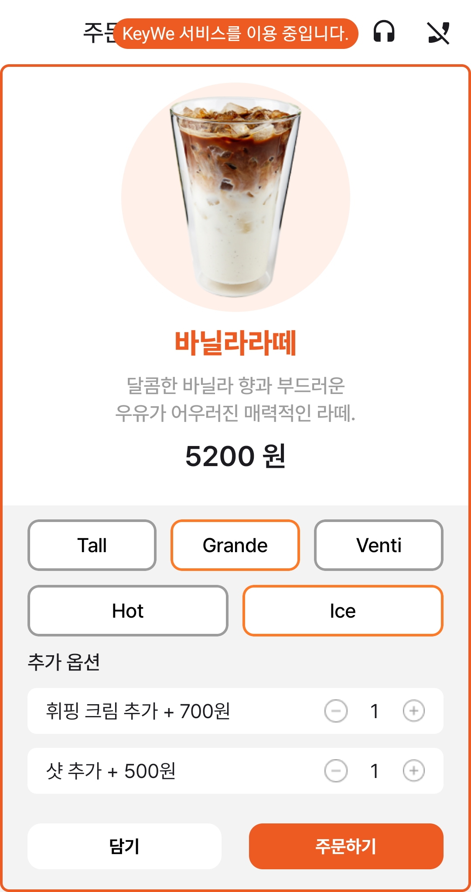

소개 : **자녀가 원격으로 대리 주문을 진행할 때 키오스크에서 표시되는 화면**. 메뉴 옵션에 대한 조작 부분이 있습니다.

### **기능 설명**

1. **상단 알림 - "KeyWe 서비스를 이용 중입니다."**
    - 키오스크가 현재 **대리 주문 모드**로 작동 중임을 나타냅니다.
    - 자녀가 스마트폰을 통해 키오스크를 원격으로 조종하고 있는 상태입니다.
2. **주황색 테두리 - 원격 조종 영역**
    - 화면의 주황색 테두리 안쪽이 **자녀가 원격으로 조작 중인 영역**입니다.
    - 자녀는 이 영역에서 **메뉴 선택, 크기 및 온도 변경, 추가 옵션 조정, 주문 추가 등의 작업**을 수행할 수 있습니다.
    - 부모님은 이 영역을 직접 터치할 수 없습니다.
3. **터치 가능 영역 (흰색 배경 부분)**
    - 키오스크에서 **부모님이 직접 터치할 수 있는 부분**은 주황색 테두리 밖의 UI 요소입니다.
    - 예를 들어, **이전 화면으로 이동(뒤로가기), 헤드폰(도움 요청) 버튼** 등은 부모님이 직접 조작할 수 있습니다.
4. **메뉴 상세 정보 및 옵션 선택**
    - 자녀가 원격으로 **"바닐라라떼 (5200원)"**을 선택하여 옵션을 설정 중입니다.
    - **크기 선택:** **Grande** (현재 선택됨)
    - **온도 선택:** **Ice** (현재 선택됨)
    - **추가 옵션:**
        - 휘핑 크림 추가 (+700원) → **1개**
        - 샷 추가 (+500원) → **1개**
    - **담기 버튼 & 주문하기 버튼**: 자녀가 원격으로 클릭하여 주문을 진행할 수 있습니다.

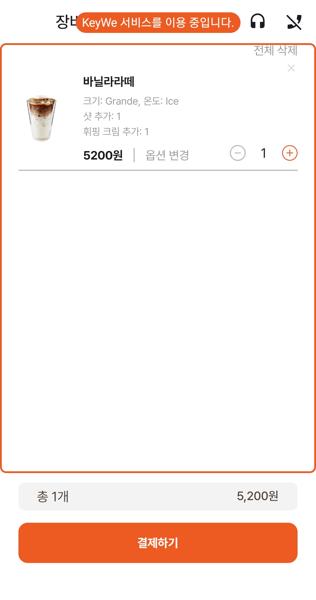

소개 : **자녀가 원격으로 대리 주문을 진행할 때, 키오스크에서 표시되는 장바구니 화면**입니다. 부모님이 직접 조작할 수 있는 부분과 자녀가 원격으로 조작하는 부분이 구분되어 있습니다.

### **기능 설명**

1. **상단 알림 - "KeyWe 서비스를 이용 중입니다."**
    - 현재 키오스크가 **대리 주문 모드**로 동작 중임을 나타냅니다.
    - 자녀가 스마트폰을 통해 원격으로 키오스크 화면을 조종하고 있습니다.
2. **주황색 테두리 - 원격 조종 영역**
    - 화면의 주황색 테두리 안쪽이 **자녀가 원격으로 조작 중인 영역**입니다.
    - 자녀는 이 영역에서 **장바구니 수정, 수량 변경, 옵션 변경, 주문 취소 등을 수행할 수 있습니다.**
    - 부모님은 이 영역을 직접 터치할 수 없습니다.
3. **터치 가능 영역 (흰색 배경 부분)**
    - 키오스크에서 **부모님이 직접 조작할 수 있는 부분**은 주황색 테두리 밖의 UI 요소입니다.
    - 예를 들어, **이전 화면으로 이동, 헤드폰(도움 요청) 버튼, 결제하기 버튼** 등은 부모님이 직접 조작할 수 있습니다.
4. **장바구니 내용 확인**
    - 현재 **"바닐라라떼 (5200원)"**이 1개 담겨 있습니다.
    - 크기: **Grande**, 온도: **Ice**
    - 추가 옵션:
        - 샷 추가 **1개**
        - 휘핑 크림 추가 **1개**
    - **"+" / "-" 버튼을 사용하여 수량을 조절 가능**
5. **결제 버튼 활성화**
    - **"결제하기" 버튼이 활성화되어 있으며**, 주문이 확정되면 결제 단계로 이동할 수 있습니다.
    - 부모님이 직접 **"결제하기" 버튼을 눌러 결제 진행 가능**

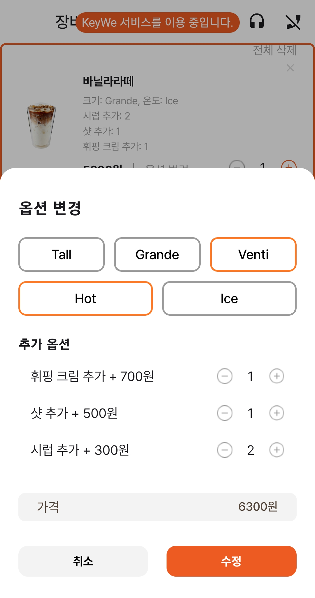

소개 : **자녀가 원격으로 대리 주문을 진행할 때, 키오스크에서 장바구니의 옵션을 수정하는 화면**입니다. 부모님이 직접 조작할 수 있는 부분과 자녀가 원격으로 조작하는 부분이 구분되어 있습니다.

### **기능 설명**

1. **상단 알림 - "KeyWe 서비스를 이용 중입니다."**
    - 현재 키오스크가 **대리 주문 모드**로 동작 중임을 나타냅니다.
    - 자녀가 스마트폰을 통해 원격으로 키오스크 화면을 조종하고 있습니다.
2. **주황색 테두리 - 원격 조종 영역**
    - 화면의 주황색 테두리 안쪽이 **자녀가 원격으로 조작 중인 영역**입니다.
    - 자녀는 이 영역에서 **음료 크기, 온도, 추가 옵션을 수정할 수 있습니다.**
    - 부모님은 이 영역을 직접 터치할 수 없습니다.
3. **터치 가능 영역 (흰색 배경 부분)**
    - 키오스크에서 **부모님이 직접 조작할 수 있는 부분**은 주황색 테두리 밖의 UI 요소입니다.
    - 예를 들어, **이전 화면으로 이동, 헤드폰(도움 요청) 버튼, 취소 버튼** 등은 부모님이 직접 조작할 수 있습니다.
4. **옵션 변경 기능**
    - 현재 **"바닐라라떼"**의 옵션을 수정하는 화면입니다.
    - **크기 선택:** **Tall, Grande, Venti** 중 선택 가능 (현재 "Grande" 선택됨)
    - **온도 선택:** **Hot 또는 Ice** 중 선택 가능 (현재 "Hot" 선택됨)
    - **추가 옵션:**
        - 휘핑 크림 추가 (+700원) → **1개**
        - 샷 추가 (+500원) → **1개**
        - 시럽 추가 (+300원) → **2개**
5. **가격 표시 및 수정 버튼**
    - 옵션 변경에 따라 **최종 가격(6300원)**이 자동으로 업데이트됩니다.
    - **"수정" 버튼**을 누르면 변경된 옵션이 적용됩니다.
    - **"취소" 버튼**을 누르면 기존 옵션이 유지됩니다.

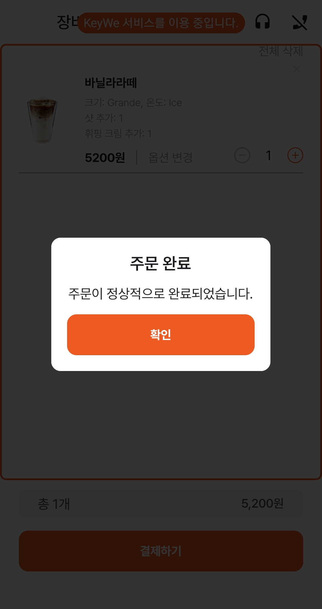

소개 : **자녀가 원격으로 주문을 완료한 후, 부모님(노인)이 키오스크에서 "결제하기" 버튼을 눌렀을 때 표시되는 주문 완료 화면**입니다.

### **기능 설명**

1. **상단 알림 - "KeyWe 서비스를 이용 중입니다."**
    - 키오스크가 **대리 주문 모드**로 실행되고 있음을 나타냅니다.
    - 자녀가 원격으로 주문을 도와주었으며, 부모님이 직접 결제를 완료한 상태입니다.
2. **주문 완료 팝업 메시지**
    - "**주문 완료**"라는 제목이 표시됩니다.
    - *"주문이 정상적으로 완료되었습니다."**라는 메시지를 통해 주문이 성공적으로 진행되었음을 부모님이 알 수 있습니다.
    - **"확인" 버튼**을 눌러 팝업을 닫을 수 있습니다.
3. **배경 화면 - 장바구니 및 결제 상태**
    - 주문 완료 후, 배경의 장바구니 화면이 비활성화되었습니다.
    - **"결제하기" 버튼이 비활성화(회색 처리)** 되어 있으며, 추가 결제 진행이 불가능함을 나타냅니다.

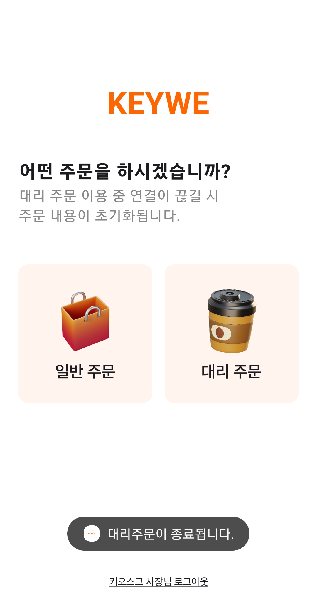

소개 : **부모님이 키오스크에서 자녀에게 원격 주문 요청을 보낸 후, 연결이 성공적으로 완료되었을 때 표시되는 화면**입니다.

### **기능 설명**

1. **상단 제목 - "대기방"**
    - 현재 **키오스크가 자녀의 스마트폰과 성공적으로 연결된 상태**임을 표시합니다.
2. **연결 성공 메시지**
    - 중앙에 "**김부모님과 연결되었습니다.**"라는 메시지가 표시됩니다.
    - 부모님과 자녀 간의 원격 주문 연결이 정상적으로 이루어졌음을 알립니다.
    - 이 메시지는 **일정 시간이 지나면 자동으로 사라지고, 키오스크가 원격 주문 모드로 전환됩니다.**

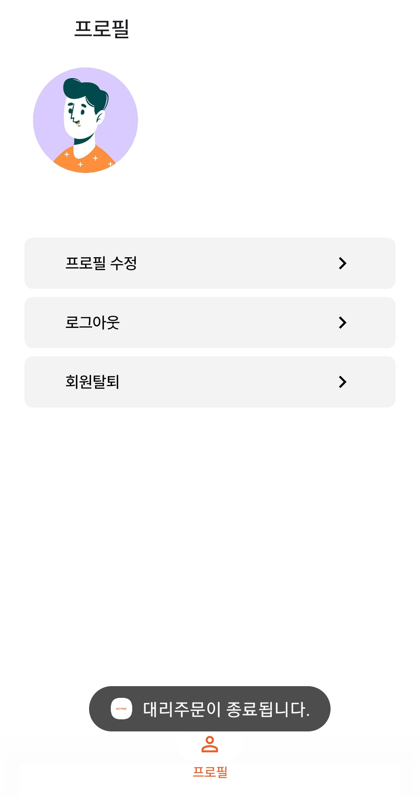

소개 : **부모님이 키오스크에서 자녀에게 원격 주문 요청을 보낸 후, 자녀의 핸드폰에서 연결이 성공적으로 완료되었을 때 표시되는 화면**입니다.

### **기능 설명**

1. **상단 제목 - "대기방"**
    - 현재 스마트폰 부모의 키오스크와 성공적으로 연결된 상태임을 표시합니다.
2. **연결 성공 메시지**
    - 중앙에 "**김싸피님과 연결되었습니다.**"라는 메시지가 표시됩니다.
    - 부모님과 자녀 간의 원격 주문 연결이 정상적으로 이루어졌음을 알립니다.
    - 이 메시지는 **일정 시간이 지나면 자동으로 사라지고, 키오스크가 원격 주문 모드로 전환됩니다.**

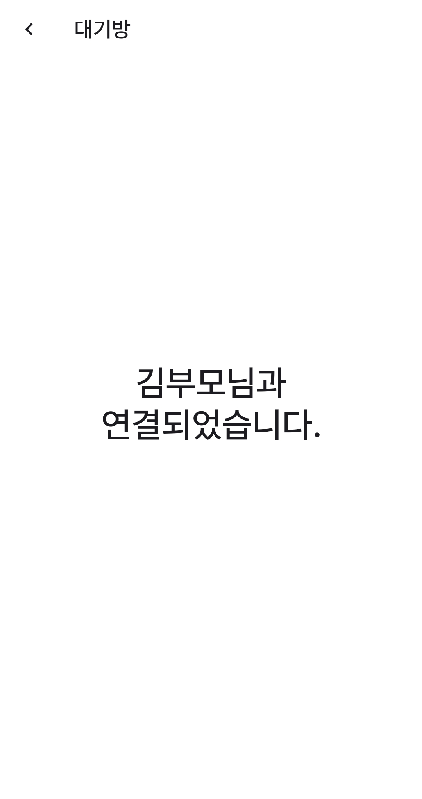

소개 : **부모님이 키오스크에서 자녀에게 원격 주문 요청을 보낸 후, 연결이 진행되는 과정**을 나타냅니다.

### **기능 설명**

1. **상단 제목 - "대기방"**
    - 현재 키오스크가 **자녀의 스마트폰과 연결을 시도하고 있는 상태**임을 표시합니다.
2. **로딩 애니메이션 (회전 아이콘) 및 상태 메시지**
    - 중앙에 **로딩 아이콘(회전하는 원형 아이콘)**이 표시됩니다.
    - 아래에는 "**연결 중.**"이라는 메시지가 나타나 **자녀의 스마트폰과 원격 연결이 진행되고 있음을 안내**합니다.
3. **기능적 역할**
    - 키오스크가 **자녀의 휴대폰을 찾고 연결하는 동안 부모님이 기다려야 함을 나타냅니다.**
    - 연결이 완료되면, 키오스크 화면이 자동으로 **대리 주문 모드로 전환**됩니다.
    - 만약 자녀가 응답하지 않거나 연결이 실패하면 **연결 실패 메시지**가 표시될 수 있습니다.

소개 : **대리 주문이 종료되었을 때, 키오스크가 다시 기본 주문 화면으로 돌아가는 상태**를 나타냅니다.

### **기능 설명**

1. **KEYWE 로고 및 주문 선택 안내**
    - 상단에 **"KEYWE"** 로고가 표시되며, 키오스크 서비스가 정상적으로 실행 중임을 나타냅니다.
    - "**어떤 주문을 하시겠습니까?**"라는 안내 문구가 표시되며, 사용자가 **"일반 주문"**과 **"대리 주문"** 중 선택할 수 있습니다.
    - *"대리 주문 이용 중 연결이 끊길 시, 주문 내용이 초기화됨"**을 안내하여 대리 주문 도중 연결이 중단될 수 있음을 미리 알려줍니다.
2. **일반 주문 & 대리 주문 선택 버튼**
    - **"일반 주문"**: 부모님이 직접 키오스크를 사용하여 주문할 경우 선택
    - **"대리 주문"**: 자녀에게 원격 도움을 요청할 경우 선택
3. **대리 주문 종료 메시지**
    - 화면 하단에 **"대리 주문이 종료됩니다."**라는 메시지가 표시되며,대리 주문이 성공적으로 종료되었음을 알립니다.
    - **이 메시지는 일정 시간이 지나면 자동으로 사라집니다.**
4. **키오스크 사장님 로그인 버튼**
    - 키오스크 관리자가 접근할 수 있는 **"키오스크 사장님 로그인"** 버튼이 제공됩니다.