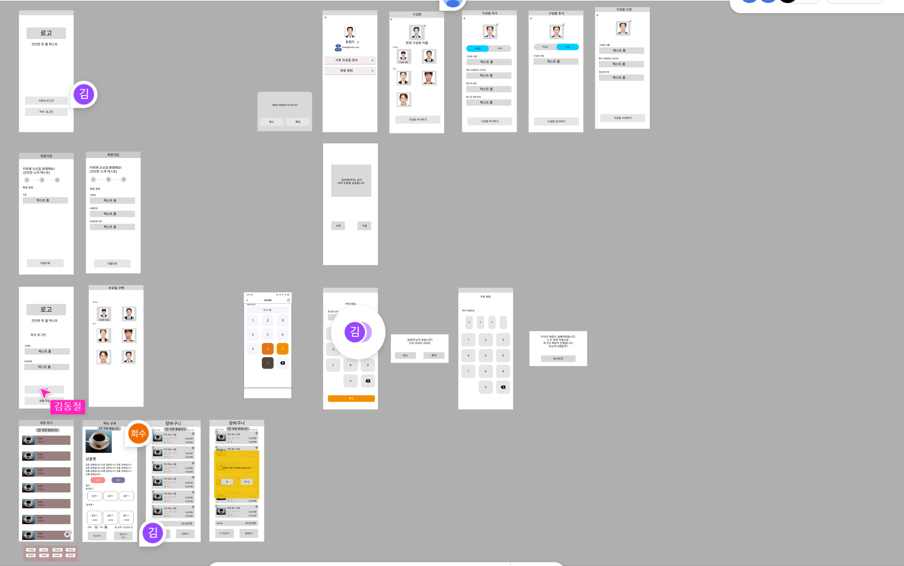

### 팀 노션
https://www.notion.so/SSAFY-PJT-17a23efc8a32809cae48f248e9ad2058

### 피그마 와이어프레임

### 안드로이드 학습 블로그 정리
1. 안드로이드 context 객체의 역할 
https://blog.naver.com/pham_cat/223724265786
2. ViewModel, AndroidViewModel 
https://blog.naver.com/pham_cat/223725266284
3. 상태 관리 
https://blog.naver.com/pham_cat/223725909033
4. 레이아웃 인플레이션 
https://blog.naver.com/pham_cat/223726680847
5. Composition 방식 
https://blog.naver.com/pham_cat/223727398239
6. 컴포저블? 컴포지션? 
https://blog.naver.com/pham_cat/223726690583

#### 카카오 로그인 연습
https://github.com/invent819/AOS_KakaoLogin

#### 참고자료 정리
https://www.notion.so/8c07e885028f4279b303cc0fe57e4bf9
https://www.notion.so/b38ae3d7dd3b4085a0972d61277b425c
