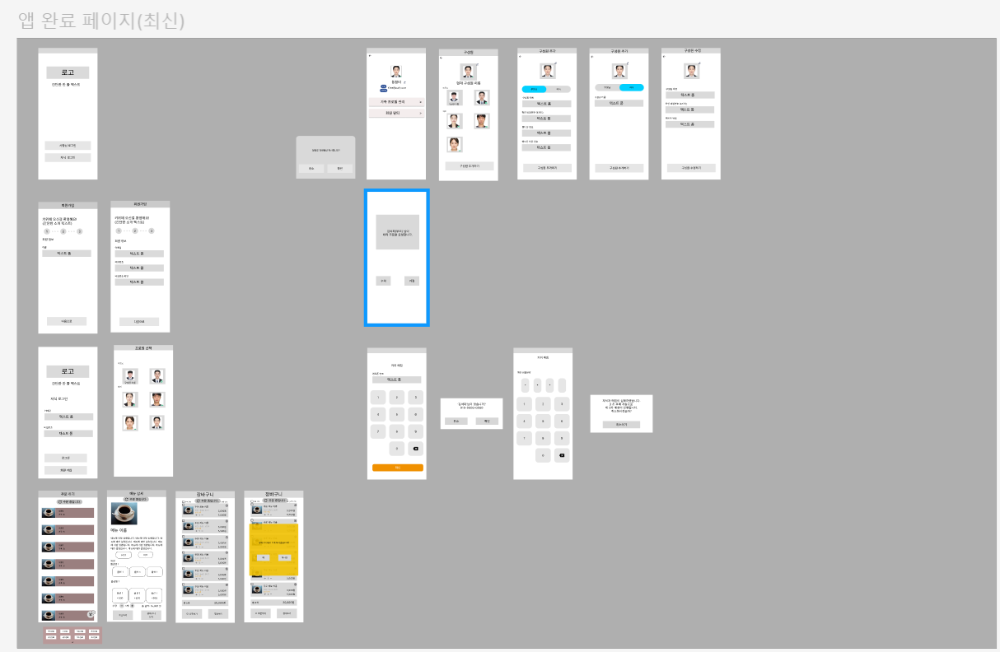

### 팀 노션
https://impossible-snout-9cd.notion.site/SSAFY-PJT-17a23efc8a32809cae48f248e9ad2058?pvs=4

### 피그마 와이어프레임

## 안드로이드 스튜디오 학습
- Udemy 'Android 14 및 Kotlin 개발 완전 정복하기' 수강 중

## 피그마 디자인 학습
- https://youtu.be/VbutDOpRtEg?si=fYObtyvs2Z5OleYm
- https://youtu.be/c6yCZecrMpQ?si=GPnEaIC_ynCXCt1J

## 요구사항 정의서
- https://docs.google.com/spreadsheets/d/1-yhAZcwYMlgATe1t7OFI1PVGGE-hXSn922OOGwUoW0w/edit?gid=0#gid=0

